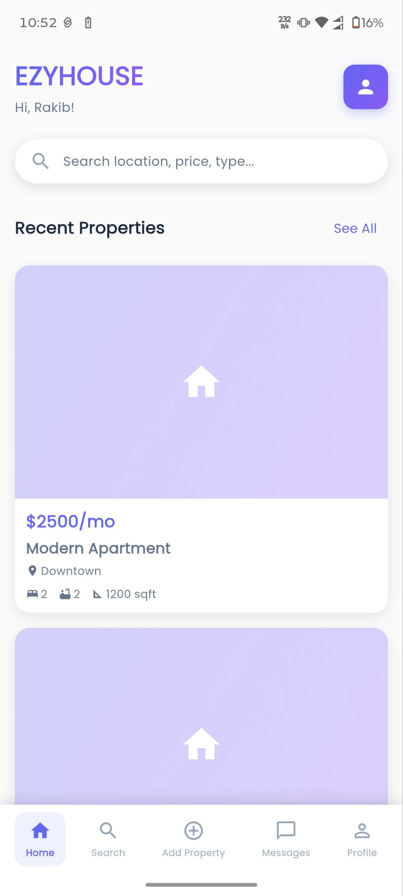
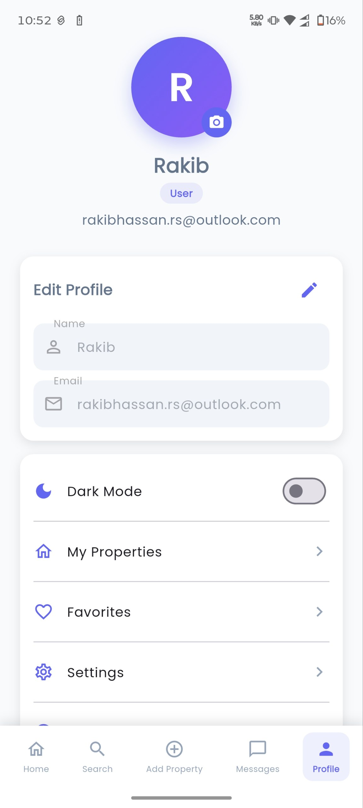
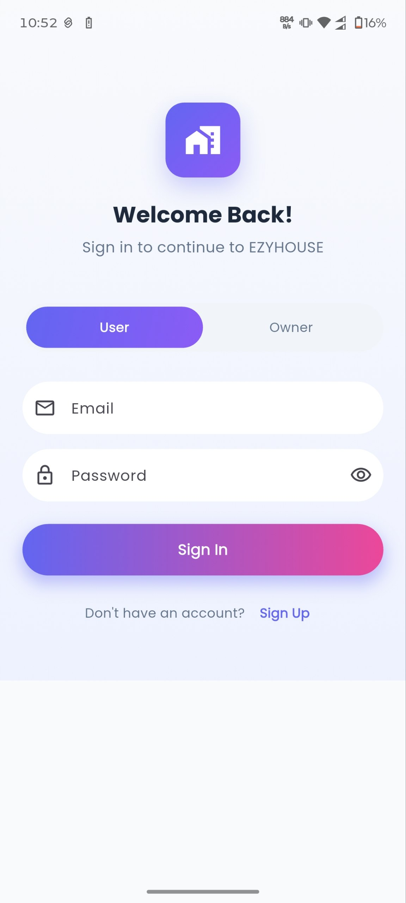
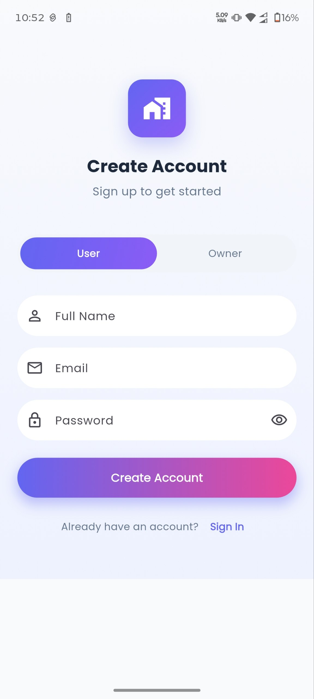
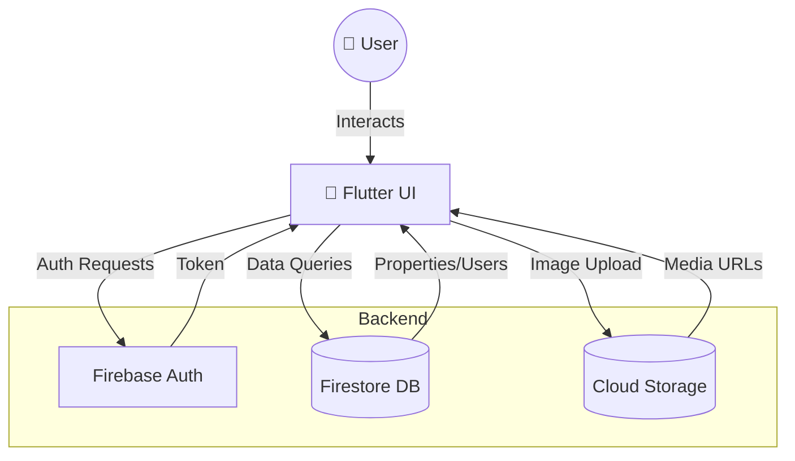

# 🏠 EZYHOUSE  
**Find the Perfect Place to Live**  
> A modern Flutter Android real estate & rental app powered by Firebase. Built for speed, security, and seamless user experience.

---

## 📸 App Preview
| 🌅 Splash | 🔐 Authentication |
|:---:|:---:|
|  |  |
| **🏠 Home & Browsing** | **👤 Profile & Settings** |
|  |  |

---

## ✨ Core Features
- 🔑 **Dual Authentication** – Email/Password & Google Sign-In via Firebase Auth
- 🔍 **Smart Filtering** – Toggle between `Home`, `Office`, `PG`, `Shop`
- 🖼️ **Image Carousel** – Smooth horizontal slider for promotions & deals
- 📝 **Post Property** – Upload images, set pricing, location & details
- ❤️ **Favourites & Profile** – Save listings, view transactions, manage account
- 📱 **Bottom Navigation** – Seamless tab switching with active state indicators
- ☁️ **Cloud Backend** – Real-time Firestore sync + Firebase Storage for media

---

## 🏗️ System Architecture

## 🛠️ Tech Stack
Layer
Technology
Frontend
Flutter 3.41, Dart 3.11, Material 3, Provider
Authentication
Firebase Auth, google_sign_in ^6.3.0
Database
Cloud Firestore (Test Mode → Production Rules)
Storage
Firebase Storage (Property Images)
Build System
Gradle 8.11, Kotlin 2.2.20, Java 17
DevOps
FlutterFire CLI, Wireless ADB Debugging

# 1. Clone & Navigate
git clone E:\Flutter Project\ezy_house2\testr\EZY_House
cd ezy_house

# 2. Install Dependencies
flutter pub get

# 3. Firebase Setup (Auto-configures keys)
C:\.pub-cache\bin\flutterfire.bat configure

# 4. Run on Wireless Device
adb connect <DEVICE_IP>:5555
flutter run --debug

⚠️ Click to expand development hurdles & fixes
  Issue
Root Cause
Fix
Gradle plugin version conflict
Explicit 4.4.4 vs Flutter-managed 4.3.15
Removed version declaration in settings.gradle.kts
Java 8 vs 17 mismatch
System PATH prioritised the old JDK
Forced JAVA_HOME=C:\Program Files\Java\jdk-17 + gradle.properties override
Firebase not initialising
Missing firebase_options.dart
Ran flutterfire configure → auto-generated platform config
Google Sign-In crash
google_sign_in 7.x breaking changes
Downgraded to ^6.3.0 & updated credential flow

gantt
    title EZYHOUSE Release Timeline
    dateFormat  YYYY-MM-DD
    section v1.0
    Core Auth & UI       :done, 2026-04-01, 7d
    Firebase Integration :done, 2026-04-08, 5d
    APK Build & Testing  :active, 2026-04-13, 4d
    section v1.1
    In-App Messaging     :2026-04-18, 7d
    Push Notifications   :2026-04-20, 5d
    section v2.0
    Payment Gateway      :2026-05-01, 10d
    AI Property Match    :2026-05-15, 14d

📞 Connect & Contribute
📧 Email: rakibhassan.rh66@protonmail.com
🔗 GitHub: @rakibhassanrh66
🌐 Portfolio: [(your link)](http://rakibhassanrh66.github.io/)
🤝 Pull requests, bug reports, and feature requests are welcome. For major changes, please open an issue first.
